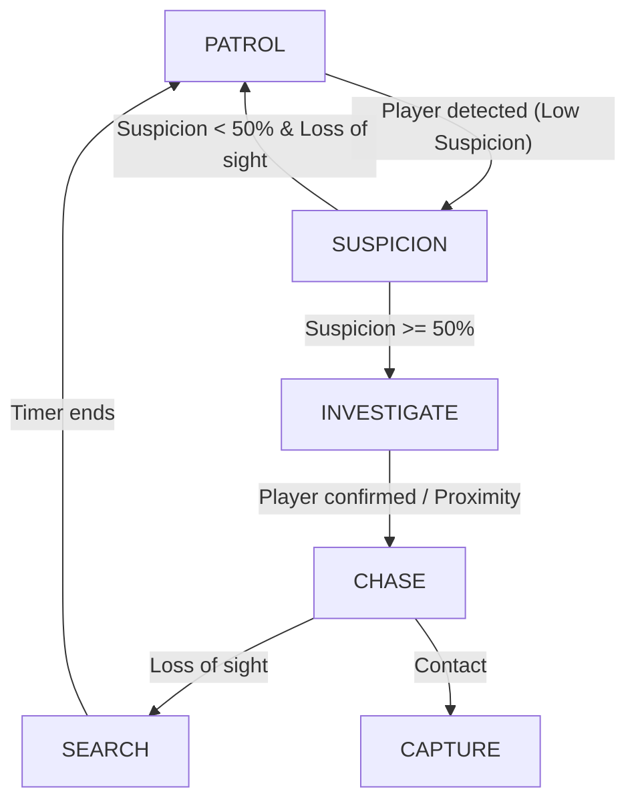

# 🧠 Guard AI: Finite State Machine (FSM)

This document defines the behavioral logic for the Guard AI and the corresponding visual feedback requirements.

## 1. State Overview & Transitions

## 2. State Details & Logic

### 🟢 PATROL (Idle/Routine)

* **Behavior:** Moves between predefined waypoints.
* **Detection:** Active 2D Vision Cone.
* **Transition:** If player enters cone, switch to **SUSPICION**.
* **Art Requirement:** `Walk_Cycle_4Way`

### 🟡 SUSPICION (Observation)

* **Behavior:** Guard stops or slows down, staring at the player's last position.
* **Logic:** * Matching Mask: Suspicion increases by **5% per sec**.
* Mismatched Mask: Suspicion increases by **25% per sec**.
* No Mask: Instant transition to **CHASE**.

* **Art Requirement:** `Alert_Icon` (Orange '?' popup)

### 🟠 INVESTIGATE (Seeking)

* **Behavior:** Guard leaves patrol route and walks towards the player's last seen position.
* **Transition:** If player is still visible and suspicion hits 100% -> **CHASE**.
* **Art Requirement:** `Walk_Fast_4Way`

### 🔴 CHASE (Active Pursuit)

* **Behavior:** Guard follows the player's path directly at increased speed.
* **Transition:** On contact -> **CAPTURE**. If sight is lost -> **SEARCH**.
* **Art Requirement:** `Run_Cycle_4Way`, `Exclamation_Icon` (Red '!' popup)

### 🔍 SEARCH (Last Known Position)

* **Behavior:** Guard looks around (left/right) at the last known position for 3 seconds.
* **Transition:** If timer ends -> **PATROL**.
* **Art Requirement:** `Look_Around_Anim`

### 🔒 CAPTURE (End State)

* **Behavior:** Freezes player movement, triggers "Caught" UI.
* **Art Requirement:** `Capture_Pose_Sprite`

## 3. Implementation Notes (For Miray)

* **Detection Logic:** Use `Raycast2D` to check for visual obstructions (walls/bushes).
* **Suspicion Decay:** If the player is out of sight, suspicion should decay by **10% per sec**.
* **Layering:** Adal's 64x64 sprites should have the `Pivot` set to `Bottom` for correct sorting.
